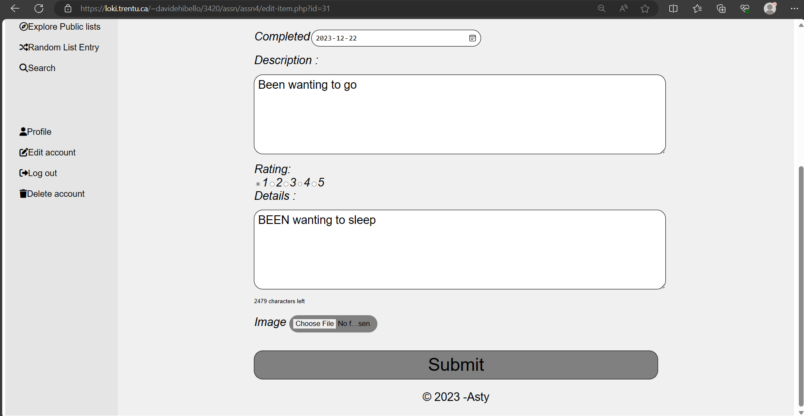

# 3420 Assignment #4 - Fall 2023

Name(s): David Ehi-Bello
        and Jethro Ashemuke


Live Loki link(s): [CREATE ACCOUNT PAGE ](https://loki.trentu.ca/~davidehibello/3420/assn/assn4/create-account.php)

[ADD ENTRY PAGE ](https://loki.trentu.ca/~davidehibello/3420/assn/assn4/add-entry.Php)

[LOG IN PAGE ](https://loki.trentu.ca/~davidehibello/3420/assn/assn4/login.php)

[FORGOT PASSWORD PAGE ](https://loki.trentu.ca/~davidehibello/3420/assn/assn4/forgot.php)

[RESET PASSWORD PAGE ](https://loki.trentu.ca/~davidehibello/3420/assn/assn4/reset.php)

[MAIN PAGE ](https://loki.trentu.ca/~davidehibello/3420/assn/assn4/index.php)

[EDIT LIST ITEM PAGE ](https://loki.trentu.ca/~davidehibello/3420/assn/assn4/edit-item.php)

[VIEW LIST ITEM PAGE ](https://loki.trentu.ca/~davidehibello/3420/assn/assn4/view-item.php)

[DELETE LIST ITEM PAGE ](https://loki.trentu.ca/~davidehibello/3420/assn/assn4/delete-item.php)

[PUBLIC LIST PAGE ](https://loki.trentu.ca/~davidehibello/3420/assn/assn4/list.php)

[SEARCH PAGE ](https://loki.trentu.ca/~davidehibello/3420/assn/assn4/search.php)

 

## Rubric

| Component                                                    | Grade |
| :----------------------------------------------------------- | ----: |
| Edit List Validation                                         |    /4 |
| Register Validation                                          |    /4 |
| Delete confirmation                                          |    /3 |
| Details modal                                                |    /5 |
|                                                              |       |
| Copy Public Link to Clipboard                                |    /3 |
| Unique Username                                              |    /3 |
| Password Strength                                            |    /3 |
| Show Password   *                                            |    /3 |
| Limiting Description Field  *                                |    /3 |
| Star Rating       *                                          |    /3 |
|                                                              |       |
| Code Quality (tidyness, validity, efficiency, etc)           |    /4 |
| Documentation                                                |    /3 |
| Testing                                                      |    /3 |
|                                                              |       |
| Bonus                                                        |  /3.5 |
| Deductions (readability, submission guidelines, originality) |       |
|                                                              |       |
| Total                                                        |   /35 |

## Things to consider for Bonus Marks (if any)


## Code & Testing

Put your code and screenshots here, **with proper heading organization**. You don't need to include html/php code (or testing) for any pages that aren't affected by your javascript for this assignment.


 # PHP Pages that incorporate Javascript


## Register Page

### HTML/PHP

```xml
<?php
include "./includes/library.php";
//Connect to Database
$pdo = connectdb();


//Retrieve Data
$username = $_POST['username'] ?? null;
$name = $_POST['name'] ?? null;
$email = $_POST['email'] ?? null;
$password = $_POST['password'] ?? null;


// Declare empty array to add errors too
$errors = array();


if ($_SERVER['REQUEST_METHOD'] === 'POST') {


    /* Validation from previous assignment is commented out so that your JavaScript can
   * be responsible for it instead */
  /* ---------------------------------------------------------------------------


//Validate variables
if (empty($username)) {
    $errors[] = 'Username is required';
}
if (empty($name)) {
    $errors[] = 'Name is required';
}
if (empty($email)) {
    $errors[] = 'Email is required';
}
if (empty($password)) {
    $errors[] = 'Password is required';
}


//Validate username
$similar_username = get_username($pdo, $username);
if ($similar_username !== null) {
    $errors[] = 'There is already a similar username';
}
--------------------------------------------------------------------------- */
 


//Insert record into database if no recorded errors
if (count($errors) === 0) {
    $encrypted_password = password_hash($password, PASSWORD_DEFAULT);
    $stmt = $pdo->prepare("INSERT INTO User_data (Username, Name, Email, Password) VALUES (?,?,?,?)");
    $stmt->execute([$username, $name, $email, $encrypted_password]);
    if ($stmt->rowCount() === 1) {
        $user_id = $pdo->LastInsertId();
        //start session
        session_start();
        // Put the username and user ID into the session array
        $_SESSION['username'] = $username;
        $_SESSION['user_id'] = $user_id ;
        // Redirect to index..php
        header('Location: index.php');
        exit(); // Make sure to stop execution after redirection
    } else {
        // Records do not match, set an error
        $errors[] = "Invalid record, cannot insert into database.";
    }
}
}

?>


<!DOCTYPE html>
<html lang="en">


<head>
    <meta charset="UTF-8">
    <meta http-equiv="X-UA-Compatible" content="IE=edge">
    <meta name="viewport" content="width=device-width, initial-scale=1.0">
    <script src="https://kit.fontawesome.com/4d41a90315.js" crossorigin="anonymous"></script>
    <link rel="stylesheet" href="./styles/main.css">
    <script defer src="./scripts/create-account.js"></script>
    <title>Create Account</title>
</head>


<body>
   
    <div class="split-layout">
     <div class="left-half">
        <h1 id="asty">ASTY</h1>
        <?php include './includes/nav.php' ?>
     </div>


        <div class="right-half">
     <nav>
                <div class="backtrack">
            <ul class="no-bullets">
                <li><a href="./join.php" style="color: grey;">Join</a></li>
                <li>></li>
                <li><a href="./create-account.php" style="color:  navy;">Create Account</a></li>
            </ul>
                </div>
        </nav>


      <main>
        <h2 id="create-account">Create Account</h2>


        <!-- Code below is to collect users data(username, name, email, password) -->
        <form id="form" method="post" novalidate >  


                <div>  
                <label for="username">Username  </label>  
                <input type="text" placeholder="Enter username" name="username" id="username" required class="input-box" >
                <div class="error"></div>
                </div>  


                <div>
                <label for="nam">Name </label>
                <input type="text" placeholder="Enter name" id="name" name="name" required class="input-box">
                <div class="error"></div>
                </div>


                <div>
                <label>Email </label>
                <input type="email" placeholder="Enter email" id="email" name="email" required class="input-box" >
                <div class="error"></div>
                </div>


                <div>
                <label>Password </label>  
                <input type="password" placeholder="Enter password" id="password" name="password" required class="input-box">
                <input type="checkbox" id="show-password" onclick="togglePasswordVisibility()">
                <label for="show-password">Show Password</label>
                <div class="error"></div>
                </div>


                <div>
               <button type="submit">Submit</button>
                </div>


                <div class="ch-remember">
                    Remember me:
                <input type="checkbox" class="defaultcheckbox" name="checkbox1" checked="checked">  
                </div>
                 
        </form>  
           
      </main>
   
      <?php include './includes/footer.php' ?>
</div>
</div>
</body>


</html>

```


## Edit list item page

### HTML/PHP

```xml
<?php
// Include the database connection file
include "./includes/library.php";

// Connect to Database
$pdo = connectdb();

// Check if the list item ID is provided in the URL
if (isset($_GET['id']) && !empty($_GET['id'])) {
    $itemId = $_GET['id'];

    // Fetch data from the database based on the list item ID
    $stmt = $pdo->prepare("SELECT * FROM User_entry WHERE entry_id = ?");
    $stmt->execute([$itemId]);
    $result = $stmt->fetch(PDO::FETCH_ASSOC);

    if (!$result) {
        // Handle invalid list item ID (redirect to an error page or main page)
        header("Location: index.php");
        exit();
    }

    // Check if the user owns the list item
    $userId = 1; 
    if ($result['user_id'] != $userId) {
        // Handle unauthorized access (redirect to an error page or main page)
        header("Location: index.php");
        exit();
    }
} else {
    // Handle missing list item ID (redirect to an error page or main page)
    header("Location: index.php");
    exit();
}

// Handle form submission
if ($_SERVER["REQUEST_METHOD"] == "POST") {
    // Retrieve and sanitize form data
    $listName = $_POST["list"];
    $itemName = $_POST["gotoasummerfestival"];
    $state = isset($_POST["state"]) ? $_POST["state"] : '';
    $created = $_POST["item-start"];
    $completed = $_POST["item-Completion"];
    $description = $_POST["description"];
    $rating = isset($_POST["rating"]) ? (int)$_POST["rating"] : 0;
   
    // Update data in the User_entry table
    $stmt = $pdo->prepare("UPDATE User_entry SET list_name = ?, item_name = ?, item_description = ?, options = ?, completion_status = ?, created = ?, completed = ?, rating = ?, WHERE entry_id = ?");
    $stmt->execute([$listName, $itemName, $description, 'private', $state, $created, $completed, $rating,  $itemId]);

    // Redirect to the main page after successful submission
    header("Location: index.php");
    exit();
}
?>
<!DOCTYPE html>
<html lang="en">
<head>
    <meta charset="UTF-8">
    <meta http-equiv="X-UA-Compatible" content="IE=edge">
    <meta name="viewport" content="width=device-width, initial-scale=1.0">
    <script src="https://kit.fontawesome.com/4d41a90315.js" crossorigin="anonymous"></script>
    <link rel="stylesheet" href="./styles/main.css">
    <script defer src="./scripts/edit.js"></script>
    <title>Edit List Item</title>
</head>

<body>
    <div class="split-layout">
        <div class="left-half">
        <h1 id="asty">ASTY</h1>
        
        <!-- Navigation-->
        <?php include './includes/nav2.php' ?>
        </div>

            <div class="right-half">
                <nav>
                <div class="backtrack">
                    <ul>
                        <li><a href="./index.php" style="color: grey;">Main</a></li>
                        <li>></li>
                        <li><a href="./edit-item.php" style="color:  navy;">Edit enttry</a></li>
                    </ul>
                </div>
            </nav>
    
        
        <main>
<!-- Code below is for user to edit list item -->
        <h2 id="edit-entry">Edit Entry</h2>

        <form method="post" id="edit-form">  
        <div>
        <label for="list">Bucket list </label>
        <select name="list" id="list">
            <option value="0" <?php echo ($result['list_name'] == '0') ? 'selected' : ''; ?>>Select one</option>
            <option value="Summer Bucket list" <?php echo ($result['list_name'] == 'Summer Bucket list') ? 'selected' : ''; ?>>Summer Bucket list</option>
            <option value="College Bucket list" <?php echo ($result['list_name'] == 'College Bucket list') ? 'selected' : ''; ?>>College bucket list</option>
        </select>
        <div class="error"></div>
    </div>

    <div>   
        <label class="edit-label">Name&nbsp;&nbsp;&nbsp;&nbsp;&nbsp;&nbsp;&nbsp;&nbsp;&nbsp;&nbsp;</label>   
        <input type="text" placeholder="Go to a summer festival" name="gotoasummerfestival" required class="input-edit" value="<?php echo $result['item_name']; ?>">
        <div class="error"></div>
    </div>

    <div>
        <label class="edit-label">State&nbsp;&nbsp;&nbsp;&nbsp;&nbsp;</label>

        <div class="radio-buttons">
            <input type="radio" id="in-progress" name="state" value="In-Progress" <?php echo ($result['completion_status'] == 'In-Progress') ? 'checked' : ''; ?>>
            <label for="in-progress">In-Progress</label>
        </div>

        <div class="radio-buttons">
            <input type="radio" id="completed" name="state" value="Completed" <?php echo ($result['completion_status'] == 'Completed') ? 'checked' : ''; ?>>
            <label for="completed">Completed</label>
        </div>
        <div class="error"></div>
    </div>

    <div>
        <div>
            <label class="edit-label">Created&nbsp;&nbsp;&nbsp;&nbsp;&nbsp;</label>
            <input type="date" id="start" name="item-start" value="<?php echo $result['created']; ?>" min="2018-01-01" max="2025-12-31" required class="input-edit">
        </div>

        <div>
            <label class="edit-label">Completed</label>
            <input type="date" id="completion" name="item-Completion" value="<?php echo $result['completed']; ?>" min="2018-01-01" max="2025-12-31" required class="input-edit">
        </div>
        <div class="error"></div>
    </div>

    <div>
        <label class="edit-label">Description : </label>
        <textarea rows="10" cols="50" name="description"><?php echo $result['item_description']; ?></textarea> 
        <div class="error"></div>
    </div>

    <div>
        <label for="rating">Rating: </label>
        <div name="star-rating" id="sta-rating" class="star-rating">
        <?php
        // Loop to generate stars based on the current rating
        for ($i = 1; $i <= 5; $i++) {
            $checked = ($i == $result['rating']) ? 'checked' : '';
            echo "<input type='radio' id='star{$i}' name='rating' value='{$i}' {$checked} />";
            echo "<label for='star{$i}' title='{$i} stars'>{$i}</label>";
        }
        ?>
        </div>
        <div class="error"></div>
    </div>


    <div>
        <label class="edit-label">Details : </label>
        <textarea rows="10" cols="50" name="details"></textarea> 
        <div id="character-counter"></div>
        <div class="error"></div>
    </div>

    <div>
        <label for="myfile">Image </label>
        <input type="File" id="myfile" name="myFile">
        <div class="error"></div>
    </div>

    <div>
        <button type="submit">Submit</button>
    </div>
        </form>

    </main>

    <?php include './includes/footer.php' ?>
    </div>
</div>  

</body>
</html>
```


## View list item page

### HTML/PHP

```xml
<?php
// Include the database connection file
include "./includes/library.php";

// Connect to Database
$pdo = connectdb();

// Check if the list item ID is provided in the URL
if (isset($_GET['id']) && !empty($_GET['id'])) {
    $itemId = $_GET['id'];

    // Fetch data from the database based on the list item ID
    $stmt = $pdo->prepare("SELECT * FROM User_entry WHERE entry_id = ?");
    $stmt->execute([$itemId]);
    $result = $stmt->fetch(PDO::FETCH_ASSOC);

    if (!$result) {
        // Handle invalid list item ID (redirect to an error page or main page)
        header("Location: index.php");
        exit();
    }
} else {
    // Handle missing list item ID (redirect to an error page or main page)
    header("Location: index.php");
    exit();
}
?>

<!DOCTYPE html>
<html lang="en">

<head>
    <meta charset="UTF-8">
    <meta http-equiv="X-UA-Compatible" content="IE=edge">
    <meta name="viewport" content="width=device-width, initial-scale=1.0">
    <script src="https://kit.fontawesome.com/4d41a90315.js" crossorigin="anonymous"></script>
    <link rel="stylesheet" href="./styles/main.css">
    <title>View List Item</title>
</head>

<body>
    
    <div class="split-layout">
        

        <div class="right-half">
            <nav>
                <div class="backtrack">
                    <ul class="no-bullets">
                        <li><a href="./index.php" style="color: grey;">Main</a></li>
                        <li>></li>
                        <li><a href="./view-item.php" style="color:  navy;">List Item</a></li>
                    </ul>
                </div>
            </nav>

            <main>
                <!-- Code below contains information about a bucket list item -->
                <h2 id="go-summer"><?php echo $result['item_name']; ?>&nbsp;&nbsp;&nbsp;&nbsp;&nbsp;<a href="./edit-item.php?id=<?php echo $itemId; ?>"><i class="fa-solid fa-pen-to-square"></i></a> &nbsp;<a href=""><i class="fa-solid fa-trash"></i></a>&nbsp;<a href=""><i class="fa-solid fa-backward"></i></a></h2>

                <div class="itemss">
                    <div class="item-details">
                        <fieldset class="stress">
                            <p data-label="List:"><a href="./Summer.html"><?php echo $result['list_name']; ?></a></p>
                        </fieldset>
                    </div>

                    <div class="item-details">
                        <fieldset class="stress">
                            <p data-label="Completion:"><?php echo $result['completed']; ?></p>
                        </fieldset>
                    </div>

                    <div class="item-details">
                        <fieldset class="stress">
                            <p data-label="Created on:"><?php echo $result['created']; ?></p> 
                        </fieldset>
                    </div>
                </div>

                <p class="custom-paragraph"><?php echo $result['item_description']; ?></p>

                " alt="<?php echo $result['item_name']; ?>" width="700" height="480">

                <div class="viewitemrating">
                    <ul class="no-bullets">
                        <?php
                        $rating = $result['rating'];
                        for ($i = 0; $i < $rating; $i++) {
                            echo '<li><i class="fa-solid fa-star"></i></li>';
                        }
                        for ($i = $rating; $i < 5; $i++) {
                            echo '<li><i class="fa-regular fa-star"></i></li>';
                        }
                        ?>
                    </ul>
                </div>

            </main>

            <?php include './includes/footer.php' ?>
        </div>
    </div>

</body>
</html>

```


## Main Page

### HTML/PHP

```xml
<?php
// Include the database connection file
include "./includes/library.php";

// Connect to Database
$pdo = connectdb();

// Start the session
session_start();

// Get the user ID from the session
$userId = $_SESSION['user_id'];

// Fetch data from the User_entry table
$stmt = $pdo->query("SELECT * FROM User_entry");
$entries = $stmt->fetchAll(PDO::FETCH_ASSOC);

?>

<!DOCTYPE html>
<html lang="en">

<head>
    <meta charset="UTF-8">
    <meta http-equiv="X-UA-Compatible" content="IE=edge">
    <meta name="viewport" content="width=device-width, initial-scale=1.0">
    <script src="https://kit.fontawesome.com/4d41a90315.js" crossorigin="anonymous"></script>
    <link rel="stylesheet" href="./styles/main.css">
    <script defer src="./scripts/model.js"></script>
    <title>Main</title>
</head>

<body>
    <div class="split-layout">
        <div class="left-half">
            <h1 id="asty">ASTY</h1>
            <?php include './includes/nav2.php' ?> 
            
        </div>

        <div class="right-half">
            <main>
                <h1 id="bucket-list">Bucket Lists</h1>

                <?php
                // Group entries by list_name
                $groupedEntries = [];
                foreach ($entries as $entry) {
                    $groupedEntries[$entry['list_name']][] = $entry;
                }

                // Loop through each list
                foreach ($groupedEntries as $listName => $listEntries) {
                    echo '<div class="summer-list">';
                    echo '<h2><span>' . $listName . '&nbsp;&nbsp;&nbsp;</span></h2>';
                    echo '<ul>';

                    // Loop through each entry in the list
                    foreach ($listEntries as $entry) {
                        echo '<li>';
                        echo '<h3>' . $entry['item_name'] . '&nbsp;<a href="./view-item.php?id=' . $entry['entry_id'] . '" class="view-item-link" data-item-id=' . $entry['entry_id'] . '"><i class="fa-solid fa-eye"></i></a><a href="./edit-item.php?id=' . $entry['entry_id'] . '"><i class="fa-solid fa-pen-to-square"></i></a><a href="./delete-item.php?id=' . $entry['entry_id'] . '" class="delete-item-link" data-item-id=' . $entry['entry_id'] . '"><i class="fa-solid fa-trash"></i></a></h3>';
                        echo '<p>' . $entry['item_description'] . '</p>';
                        echo '</li>';
                    }

                    echo '</ul>';
                    echo '</div>';
                }
                ?>
            </main>

            <?php include './includes/footer.php' ?>
        </div>
    </div>
</body>

</html>

```


## Delete list Item page

### HTML/PHP

```php
<?php
// Include the database connection file
include "./includes/library.php";

// Connect to Database
$pdo = connectdb();

// Start the session
session_start();

// Check if an entry_id is provided in the URL
if (isset($_GET['id'])) {
    $entryId = $_GET['id'];

    // Fetch the entry from the User_entry table
    $stmt = $pdo->prepare("SELECT * FROM User_entry WHERE entry_id = ?");
    $stmt->execute([$entryId]);
    $entry = $stmt->fetch(PDO::FETCH_ASSOC);

    // Check if the entry exists and the user owns it
    if ($entry && $entry['user_id'] == $_SESSION['user_id']) {
        // Delete the entry from the database
        $stmt = $pdo->prepare("DELETE FROM User_entry WHERE entry_id = ?");
        $stmt->execute([$entryId]);

        // Redirect to the main page after deletion
        header('Location: index.php');
        exit();
    } else {
        // Entry not found or user does not own it, handle accordingly
        echo 'Entry not found or you do not have permission to delete.';
    }
} else {
    // No entry_id provided in the URL
    echo 'Invalid request.';
}
?>

```


## Delete account page

### HTML/PHP

```php
<?php
// Include the database connection file
include "./includes/library.php";

// Start the session
session_start();

// Check if the user is logged in
if (!isset($_SESSION['user_id'])) {
    // Redirect to the login page if the user is not logged in
    header("Location: login.php");
    exit();
}

// Connect to Database
$pdo = connectdb();

// Get the user ID from the session
$userID = $_SESSION['user_id'];

// Delete all data associated with the user
try {
    // Delete entries associated with the user from the User_entry table
    $stmtEntries = $pdo->prepare("DELETE FROM User_entry WHERE user_id = ?");
    $stmtEntries->execute([$userID]);

    // Delete the user account data from the User_data table
    $stmtUserData = $pdo->prepare("DELETE FROM User_data WHERE id = ?");
    $stmtUserData->execute([$userID]);

    // Destroy the session
    session_destroy();

    // Redirect to the login page after successful deletion
    header("Location: login.php");
    exit();
} catch (PDOException $e) {
    // Handle the exception, you might want to log it or display an error message
    echo "Error: " . $e->getMessage();
}
?>

```


# JAVASCRIPT pages 

## Create-account.js (USED FOR REGISTER PAGE(create-account.php))

### Javascript
```js
"use strict";

document.addEventListener("DOMContentLoaded", function () {
    validateForm();
    function validateForm() {
const form = document.getElementById('form');
const username = document.getElementById('username');
const name = document.getElementById('name');
const email = document.getElementById('email');
const password = document.getElementById('password');


form.addEventListener('submit', e => {
    e.preventDefault();

    validateInputs();
});

const setError = (element, message) => {
    const inputControl = element.parentElement;
    const errorDisplay = inputControl.querySelector('.error');

    errorDisplay.innerText = message;
    inputControl.classList.add('error');
    inputControl.classList.remove('success')
}

const setSuccess = element => {
    const inputControl = element.parentElement;
    const errorDisplay = inputControl.querySelector('.error');

    errorDisplay.innerText = '';
    inputControl.classList.add('success');
    inputControl.classList.remove('error');
};

const isValidEmail = email => {
    const re = /^(([^<>()[\]\\.,;:\s@"]+(\.[^<>()[\]\\.,;:\s@"]+)*)|(".+"))@((\[[0-9]{1,3}\.[0-9]{1,3}\.[0-9]{1,3}\.[0-9]{1,3}\])|(([a-zA-Z\-0-9]+\.)+[a-zA-Z]{2,}))$/;
    return re.test(String(email).toLowerCase());
}

const validateInputs = () => {
    const usernameValue = username.value.trim();
    const nameValue = name.value.trim();
    const emailValue = email.value.trim();
    const passwordValue = password.value.trim();
    
    let formIsValid = true;


    if(usernameValue === '') {
        setError(username, 'Username is required');
        formIsValid = false;
    } else {
        setSuccess(username);
    }

    if(nameValue === '') {
        setError(name, 'name is required');
        formIsValid = false;
    } else {
        setSuccess(name);
    }

    if(emailValue === '') {
        setError(email, 'Email is required');
        formIsValid = false;
    } else if (!isValidEmail(emailValue)) {
        setError(email, 'Provide a valid email address');
        formIsValid = false;
    } else {
        setSuccess(email);
    }

    if(passwordValue === '') {
        setError(password, 'Password is required');
        formIsValid = false;
    } else if (passwordValue.length < 8 ) {
        setError(password, 'Password must be at least 8 character.')
        formIsValid = false;
    } else {
        setSuccess(password);
    }

    if (formIsValid) {
        form.submit();
    }

};
}


});


function togglePasswordVisibility() {
    const passwordInput = document.getElementById('password');
    const showPasswordCheckbox = document.getElementById('show-password');

   // Toggle the type attribute of the password input
   passwordInput.type = showPasswordCheckbox.checked ? 'text' : 'password';
   }

```


## edit.js (USED FOR edit list item PAGE(edit-item.php))

### Javascript
```js
"use strict";

document.addEventListener("DOMContentLoaded", function () {
    
    
    // Function to validate the form
    function validateForm() {
        // Reset previous error messages
        resetErrors();


        // Validate each input
        let isValid = true;


        // Validate list selection
        const list = document.getElementById("list").value;
        if (list === '0') {
            displayError("list", "Please select a bucket list.");
            isValid = false;
        }


        // Validate name
        const itemName = document.getElementById("gotoasummerfestival").value;
        if (!itemName.trim()) {
            displayError("gotoasummerfestival", "Please enter the name.");
            isValid = false;
        }


        // Validate date format
        const createdDate = document.getElementById("start").value;
        const completedDate = document.getElementById("completion").value;


        if (!isValidDateFormat(createdDate)) {
            displayError("item-start", "Invalid date format. Please use YYYY-MM-DD.");
            isValid = false;
        }


        if (!isValidDateFormat(completedDate)) {
            displayError("item-Completion", "Invalid date format. Please use YYYY-MM-DD.");
            isValid = false;
        }


        // Validate description
        const description = document.getElementById("description").value;
        if (!description.trim()) {
            displayError("description", "Please enter a description.");
            isValid = false;
        }


        // Validate rating
        const rating = document.getElementById("rating").value;
        if (rating === '0') {
            displayError("rating", "Please select a rating.");
            isValid = false;
        }


         // Validate details
         const details = document.getElementById("details").value;
         if (!description.trim()) {
             displayError("details", "Please enter a description.");
             isValid = false;
         }


        return isValid;
    }


    // Event listener for form submission
    document.getElementById("edit-form").addEventListener("submit", function (event) {
        if (!validateForm()) {
            // Prevent form submission if validation fails
            event.preventDefault();
        }
    });


    // Function to display an error message
    function displayError(field, message) {
        const errorSpan = document.querySelector(`#${field} + .error`);
        errorSpan.textContent = message;
    }


    // Function to reset error messages
    function resetErrors() {
        const errorSpans = document.querySelectorAll(".error");
        errorSpans.forEach((span) => (span.textContent = ""));
    }


    // Function to validate date format (YYYY-MM-DD)
    function isValidDateFormat(dateString) {
        const dateFormatRegex = /^\d{4}-\d{2}-\d{2}$/;
        return dateFormatRegex.test(dateString);
    }

    


 // rating field star system implementation
    const starRating = document.getElementById("star-rating");
    const ratingInputs = starRating.querySelectorAll("input[name='rating']");
    const errorDisplay = document.querySelector(".error");

    // Event listener for rating inputs
    ratingInputs.forEach((input) => {
        input.addEventListener("change", function () {
            resetErrors();
            const selectedRating = this.value;
            console.log("Selected Rating:", selectedRating);
        });
    });

    function resetErrors() {
        errorDisplay.textContent = "";
    }


  
    
});

// WORD LIMIT ON DETAILS implementation
document.addEventListener("DOMContentLoaded", function () {
    const descriptionTextarea = document.querySelector('textarea[name="details"]');
    const characterCounter = document.querySelector('#character-counter');

    // Set the initial character count
    updateCharacterCount();

    // Add an input event listener to the description textarea
    descriptionTextarea.addEventListener('input', function () {
        updateCharacterCount();
    });

    function updateCharacterCount() {
        const maxLength = 2500;
        const currentLength = descriptionTextarea.value.length;
        const charactersLeft = maxLength - currentLength;

        // Display the character count
        characterCounter.textContent = `${charactersLeft} characters left`;

        // Change the color based on the remaining characters
        if (charactersLeft >= 0) {
            characterCounter.style.color = 'black'; // or any color you prefer
        } else {
            characterCounter.style.color = 'red'; // or any color you prefer for exceeded limit
        }
    }
});

```


## modal.js (USED FOR main PAGE(index.php), view item page(view-item.php), delete item (delete-item.php),  delete account page (delete-account.php))

### Javascript
```js


document.addEventListener("DOMContentLoaded", function () {

     // JAVASCRIPT TO VIEW LIST ITEMS IN MODEL WINDOW
    const items = document.querySelectorAll('.view-item-link');

    items.forEach(item => {
        item.addEventListener('click', function (event) {
            event.preventDefault();
            const itemId = this.getAttribute('data-item-id');
            openModal(itemId);
        });
    });

    function openModal(itemId) {
        // Fetch data from the server using AJAX
        fetch(`view-item.php?id=${itemId}`)
            .then(response => response.text())
            .then(data => {
                // Create a modal
                const modal = document.createElement('div');
                modal.classList.add('modal');
                modal.innerHTML = data;

               // Add styles to center the modal
            modal.style.position = 'fixed';
            modal.style.top = '50%';
            modal.style.left = '50%';
            modal.style.transform = 'translate(-50%, -50%)';

                // Append the modal to the body
                document.body.insertAdjacentElement('beforeend', modal);

                // Close modal when clicking outside of it
                modal.addEventListener('click', function (event) {
                    if (event.target === modal) {
                        closeModal();
                    }
                });

                // Close modal when pressing the ESC key
                document.addEventListener('keydown', function (event) {
                    if (event.key === 'Escape') {
                        closeModal();
                    }
                });
            })
            .catch(error => {
                console.error('Error fetching data:', error);
            });
    }

    function closeModal() {
        const modal = document.querySelector('.modal');
        if (modal) {
            modal.remove();
        }
    }


        // JAVASCRIPT TO CONFIRM THE DELETION OF AN ITEM
        const deleteLinks = document.querySelectorAll('.delete-item-link');
    
        deleteLinks.forEach(link => {
            link.addEventListener('click', function (event) {
                event.preventDefault();
    
                const itemId = this.getAttribute('data-item-id');
                const confirmation = confirm('Are you sure you want to delete this item?');
    
                if (confirmation) {
                    // If user clicks OK, proceed with deletion
                    window.location.href = `./delete-item.php?id=${itemId}`;
                }
            });
        });
  


// JAVASCRIPT TO CONFIRM THE DELETION OF AN ACCOUNT
console.log("Model.js loaded");

const deleteAccountLinks = document.querySelectorAll('.delete-account-link');

deleteAccountLinks.forEach(link => {
    link.addEventListener('click', function (event) {
        event.preventDefault();

        console.log("Delete account link clicked");

        const confirmation = confirm('Are you sure you want to delete your account?');

        console.log("Confirmation dialog result:", confirmation);

        if (confirmation) {
            console.log("User confirmed. Proceeding with account deletion.");
            // If user clicks OK, proceed with account deletion
            window.location.href = `./delete-account.php`;
        } else {
            console.log("User canceled account deletion.");
        }
      });
  });

    
});
```


## Testing

### VALIDATION FOR register form

### CROSS BROWSER TESTING


### VALIDATION FOR Edit list item form


### VIEW ITEM PAGE IN modal window 

### CROSS BROWSER TESTING


###  Incorporation of a "show password" which makes the password field temporarily visible


### CROSS BROWSER TESTING

 


### Limitation of details feild to 2500 characters

### CROSS BROWSER TESTING



### Bucket list Items using star ratings


### CROSS BROWSER TESTING


###  received JS-driven confirmation dialog (delete/cancel) when a user attempts to delete a list

### CROSS BROWSER TESTING


###  received JS-driven confirmation dialog (delete/cancel) when a user attempts to delete an account

### CROSS BROWSER TESTING


